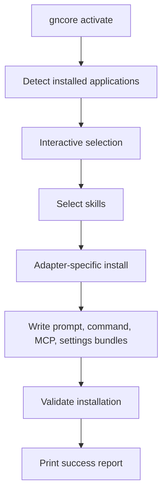

# Architecture

GNCore uses clean architecture boundaries:

- CLI
- Core services
- Adapters
- Skills
- Installer and backup services
- Validators
- Utilities
- Configuration

## Core flow

## Layer responsibilities

The CLI parses user input and dispatches to managers. It never writes application files directly.

The core layer coordinates skill selection, adapter discovery, installation, rollback, backup, diagnostics, and version reporting.

The adapter layer contains one class per supported application. Each adapter resolves its own config root, discovers executables or config roots, and knows how to serialize GNCore bundles for that application.

The skill layer contains the internal skill catalog. Skills are versioned, independently installable, and serializable into multiple output formats.

The utilities layer handles JSON and atomic file writing so the installer never leaves partial files behind.

## Adapter contract

Every adapter must implement the same behavior:

- detect the application
- resolve a writable config root
- install a selected skill set
- uninstall the managed bundle
- validate the installation

That keeps the application surface extensible without duplicating installer logic.

## Bundle shape

GNCore writes a managed `gncore/` bundle under each target application's config directory. The bundle includes:

- `manifest.json`
- `bundle.json`
- `settings.json`
- `mcp.json`
- `skills/<skill-id>/...`
- `prompts/<skill-id>.md`
- `commands/<skill-id>/<command>.md`

The manifest makes update, backup, restore, and validation deterministic.

## Validation and rollback

Validation checks that the manifest exists and that every recorded skill file is still present. Backup writes a zip archive with a backup manifest, and restore replays the archive back into the recorded application roots.
